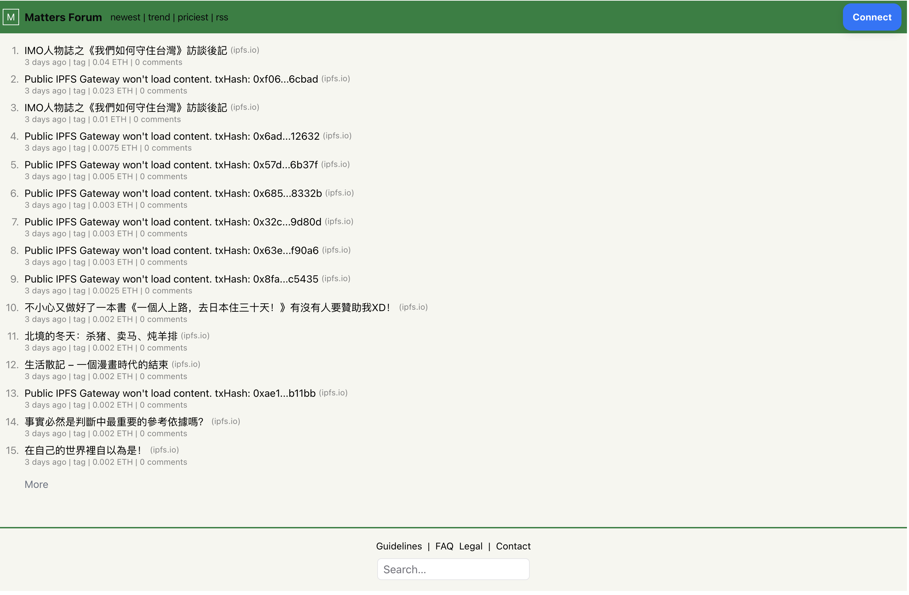

# Matters Forum

## Motivation

The guide has asked to make something interesting, so I replicated some workflows that I would personally like to see if I were to make apps or improvements on top of the matters app. This app is fully deployed on [matters-forum.vercel.app](https://matters-forum.vercel.app)

Not to being critical on the current state of UI of matters, but I prefer something more lightweight and contentful that respond almost instantly to my perception, such as the [hackernews](https://news.ycombinator.com/) interface. I interact with it through an RSS reader interface, and if I would like to interact with the post, the individual item page isn't too clunky either. I want to recreate something lightweight but not lack of capturing the unique decentralized & uncensored content on matters.

## Architechture

This is a brief overview of the application.

With [viem.sh](https://viem.sh/), the `Curation` event on optimism is constantly indexed to the database once they were emitted, and a cron job that runs every 6 hours will also catch the ones that the `watchEvent` [function](https://viem.sh/docs/actions/public/watchEvent#watchevent) did not catch just in case.

When the users first access the page, they will see a hackernews-esque interface with page limit of `15` posts. The `More` button at the bottom will run the next page of posts. Some of the title may not load because I was using a free IPFS gateway, which is very unstable to public access. Things should work smoothly if switched over to the paid plans.

Once you click on the title of the post, it will lead you to the destined IPFS content, just like the hackernews interface. Clicking on `<> comments` will lead you to the items page, which you would be able to write a reply if you connect your wallet to this app. You can also see others reply there.

There are 3 main routes to this app:

- `/` & `/newest` - rank posts by either creation date or block number
- `/trend` - this ranks the post by the number of comments it have
- `/priciest` - this ranks the post by the `amount` of donation onchain
- `/api/rss` - the xml for rss reader to subscribe to. You can also access the content on `/rss`

You can check the database schema [here](./src/lib/db.schema.ts), but a brief overview will be 3 tables in postgres:

- curations
- comments
- users

Each are pretty self-explanatory. The interface pretty much replicated hackernews, so if there's confusion, feel free to compare both of them.

## Key features

- _Wallet Connect_: use rainbowkit + wagmi.sh + viem.sh for onchain interaction + to comment
- _Sorting_: order by price, creation date, comment count, etc
- _Comment_: interact with the posts after you connect wallet address
- _rss_: subscribe to the feed through web1 fashion
- _Server-side-rendering_: through nextjs App router, brings in a state of the art fullstack experience.
- _Rate limiting_: redis on vercel KV can limit the amount of comments
- _ORM_: Drizzle DB + Postgres @ Supabase for effortless database and API integration
- _Styling_: tailwindCSS + Shadcn + Lucide for modern looks of UI
- _Type Safety_: Server Action + Zod to achieve fullstack type safety

## Showcase
### Default feed:

### Connect wallet:

### Rank by Price:

### RSS Feed:

## Tech Stack

- [Next.js](https://nextjs.org) - mega react framework
- [Drizzle ORM](https://orm.drizzle.team/) & [Drizzle Kit](https://orm.drizzle.team/kit-docs/overview)- very handy ORM for all types of db and drizzle studio
- [React Query](https://tanstack.com/) - you cant run away from it
- [RainbowKit](https://www.rainbowkit.com/) - wallet connect
- [viem.sh](https://viem.sh/) - event listener + filter
- [Wagmi](https://wagmi.sh/) - client side eth interaction
- [Alchemy](https://alchemy.com/) - node interaction
- [Supabase](https://supabase.com/) - postgres hosting
- [Zod](https://zod.dev/) - schema validation
- [Tailwind CSS](https://tailwindcss.com) - css framework
- [Shadcn UI](https://ui.shadcn.com/) - UI framework
- [Lucide](https://lucide.dev/) - icons
- [Vercel KV + Redis](https://vercel.com/docs/storage/vercel-kv) - rate limitor
- [Axiom](https://axiom.co/) - log collection + dashboard

## Getting Started Locally

1. Clone this repository to your local machine.
2. Copy `.env.example` to `.env` and fill in the required environment variables.
3. Run `pnpm install` to install dependencies.
4. Run `pnpm migrate` to push your schema to the database.
5. Execute `pnpm dev` to start the development server and enjoy!

## Roadmap

- [x] scaffolding everything and make initial deployment
- [x] IPFS indexer
- [x] skeleton platform (sorting, searching, etc)
- [x] auth + web address verification
- [x] integration
- [x] queryselect the `<h1>` tag of the html and populate them
- [ ] add search - TODO: needs to index title, which cant do in public gateway
- [x] cron to insert logs
- [x] fix that weird hydration error
- [x] add sorting for price
- [x] maybe a loading state for the title (not grabbing all the feed at once)

Lots of the limitation is around:

- public IPFS gateway - can't index titles at all, have to make it pessimistic from the client
- wallet connect + auth - right now the auth is only client side. The next-auth doc for a full auth layer is outdated for app router, so it requires a complete remake for the tools.

I pretty much have to learn everything from the ground up as my web3 dev experience is still lagging behind in 2022 + next page router. A lot has changed in the past 2 years, and this honestly has been pretty challenging to implement. I've rarely done something this unknown in the past, but it was fun to dig through the docs and find possible integration in between. And I am really impressed about how much the React ecosystem can offer, I mean this is crazy to integrate and things actually broke only 5 or 6 times through out the process with is not bad for web3 dev where everything is incompatible with each other and all those unmet peer deps, etc.

Only thing is that I've not done extensive documentation for the code in jsdoc, but most of them are pretty self-explanatory and are react components anyways. I do have a lot of commented out code that I have not used, but that was because I want to continue to work on this project after this was done. I am happy that I was able to make this little almost hackathon project from the ground up. When I started working on this, I still can't figure out what most of the app router is supposed to be doing and those weird server/client side components and their intermingleness.

## Contributing

To contribute, fork the repository and create a feature branch. Test your changes, and if possible, open an issue for discussion before submitting a pull request. Follow project guidelines, and welcome feedback to ensure a smooth integration of your contributions. Your pull requests are warmly welcome.
